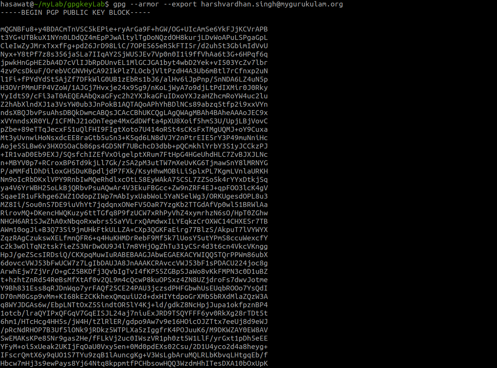

# BLOG Summary: GPG Encryption
Refrence: https://www.gnupg.org/gph/en/manual/c14.html

In this article; learned about GPG; an encryption and signing tool for Linux and UNIX-like operating systems.
Creating key for encryption/decryption of document
Encrypting the document using key and with passphrase

# Overview: 
GnuPG stands for GNU Privacy Guard and is GNU’s tool for secure communication and data storage. It can be used to encrypt data and to create digital signatures. It includes an advanced key management facility.

GPG is a free software under GNU General Public License.

It also provides windows version; Gpg4win is a Windows version.


# Encrypting and decrypting documents

Public key is used to encrypt the document,and correspondin private key is used to decrypt it.
The article explains encryption and decryption process with an example of safe and key.
If you want to encrypt a message to Alice, you encrypt it using Alice's public key, and she decrypts it with her private key. If Alice wants to send you a message, she encrypts it using your public key, and you decrypt it with your key.


# Creating an encryption key

A GPG key pair can be generated via  gpg --gen-key command


Once you accept the user ID, GPG will prompt you to enter and confirm a password. Afterward, GPG will begin generating your key.
More details: https://www.gnupg.org/gph/en/manual/c14.html

# Encrypting a file
```
alice% gpg --output doc.gpg --encrypt --recipient blake@cyb.org doc

```


To encrypt a document the option --encrypt is used. 
doc is name of the document to encrypt as input, if omitted, on standard input.
The --recipient option is used once for each recipient and takes an extra argument specifying the public key to which the document should be encrypted. 
The encrypted result is placed on standard output or as specified using the option --output.

The encrypted document can only be decrypted by someone with a private key that complements one of the recipients' public keys. In particular, you cannot decrypt a document encrypted by you unless you included your own public key in the recipient list.
After confirming the encrypted version has been created, you can delete the original unencrypted file.


# Decrypting a file

To decrypt a message the option --decrypt is used. You need the private key to which the message was encrypted.
```
blake% gpg --output doc --decrypt doc.gpg

```


GPG will prompt you for the password associated with the key you used to encrypt the file. When you enter the correct password, GPG will recreate the original, unencrypted version of the file (e.g., my_file). This process does not delete or alter the encrypted version of the file (my_file.gpg).


# Exchanging keys

List the keys on public keyring:
```
alice% gpg --list-keys
```


# Exporting a public key

To send your public key to a correspondent you must first export it using option --export.
```
alice% gpg --output alice.gpg --export alice@cyb.org

The key is exported in a binary format, for more protection use --armor option which generats the key in an ASCII-armored format.

alice% gpg --armor --export alice@cyb.org
```



# Importing a public key

A public key may be added to your public keyring with the --import option.
```

alice% gpg --import blake.gpg

gpg: key 9E98BC16: public key imported
gpg: Total number processed: 1
gpg:               imported: 1
alice% gpg --list-keys
/users/alice/.gnupg/pubring.gpg
---------------------------------------
pub  1024D/BB7576AC 1999-06-04 Alice (Judge) <alice@cyb.org>
sub  1024g/78E9A8FA 1999-06-04

pub  1024D/9E98BC16 1999-06-04 Blake (Executioner) <blake@cyb.org>
sub  1024g/5C8CBD41 1999-06-04
```
Once a key is imported it should be validated. although GNUPG validates the inported key, but some keys may need to be personally validted.

# Validating Key:

A key is validated by verifying the key's fingerprint and then signing the key to certify it as a valid key.
A key's fingerprint can be quickly viewed with the --fingerprint command-line option

* Firstly edit the key
```
alice% gpg --edit-key blake@cyb.org

pub  1024D/9E98BC16  created: 1999-06-04 expires: never      trust: -/q
sub  1024g/5C8CBD41  created: 1999-06-04 expires: never     
(1)  Blake (Executioner) <blake@cyb.org>
```

* Varify the fingerprint with the key's owner.
```
gpg> fpr
pub  1024D/9E98BC16 1999-06-04 Blake (Executioner) <blake@cyb.org>
             Fingerprint: 268F 448F CCD7 AF34 183E  52D8 9BDE 1A08 9E98 BC16
```
* Sign the key to validate it.
```
 gpg> sign
             
pub  1024D/9E98BC16  created: 1999-06-04 expires: never      trust: -/q
             Fingerprint: 268F 448F CCD7 AF34 183E  52D8 9BDE 1A08 9E98 BC16

     Blake (Executioner) <blake@cyb.org>

Are you really sure that you want to sign this key
with your key: "Alice (Judge) <alice@cyb.org>"

Really sign?
```
Once signed you can check the key to list the signatures on it and see the signature that you have added. Every user ID on the key will have one or more self-signatures as well as a signature for each user that has validated the key.
```
gpg> check
uid  Blake (Executioner) <blake@cyb.org>
sig!       9E98BC16 1999-06-04   [self-signature]
sig!       BB7576AC 1999-06-04   Alice (Judge) <alice@cyb.org>
```

